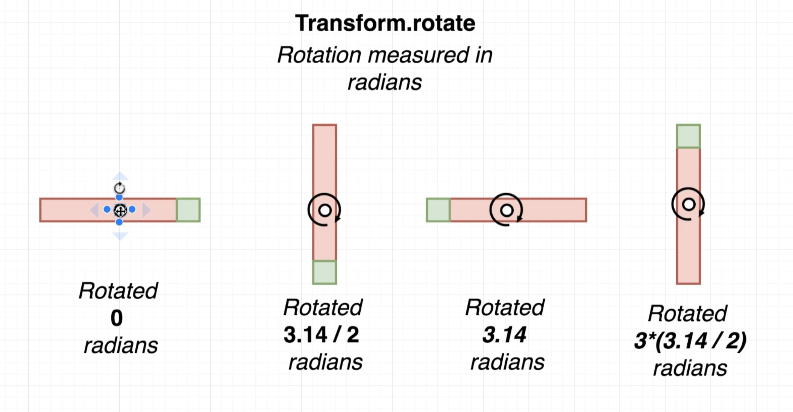

# Animation Classes

## Ref

[Animation](https://www.notion.so/Animation-897b54a5b7db488c8f5c375cb5855935)


### Animation

- Records the current 'value' of the property being animated
- Records the status of the animation (currently running, stopped, etc)
- status: 'stopped', yPosition: 110px

### AnimationController

- Starts, stops, restarts the animation
- Records the duration of the animation
- duration: 1 second, start(), stop()

### Tween

- Describes the range that the value being animated spans
- starts with a value of 0px, end with a value of 200px

### AnimatedBuilder

- Takes an animation and a 'builder' function.
- Every time the animation ticks (changes value), builder reruns

# Push Down Once

```dart
Widget buildAnimation() {
  return AnimatedBuilder(
    animation: catAnimation!,
    builder: (context, child) {
      return Container(
        child: child,
        margin: EdgeInsets.only(top: catAnimation!.value),
      );
    },
    child: Cat(),
  );
}

void onTap() {
  catContoller!.forward();
}
```

```dart
import 'package:flutter/material.dart';
import '../widgets/cat.dart';

class Home extends StatefulWidget {
  @override
  State<StatefulWidget> createState() {
    return HomeState();
  }
}

class HomeState extends State<Home> with TickerProviderStateMixin {
  Animation<double>? catAnimation;
  AnimationController? catContoller;

  initState() {
    super.initState();
    catContoller = AnimationController(
      duration: Duration(seconds: 5),
      vsync: this, //Vsync basically keeps the track of screen
    );
    catAnimation = Tween(begin: 0.0, end: 100.0).animate(
      CurvedAnimation(
        parent: catContoller!,
        curve: Curves.easeIn,
      ),
    );
  }

  void onTap() {
    catContoller!.forward();
  }

  @override
  Widget build(BuildContext context) {
    return Scaffold(
      appBar: AppBar(
        title: Text('Animation'),
      ),
      body: GestureDetector(
        child: buildAnimation(),
        onTap: onTap,
      ),
    );
  }

  Widget buildAnimation() {
    return AnimatedBuilder(
      animation: catAnimation!,
      builder: (context, child) {
        return Container(
          child: child,
          margin: EdgeInsets.only(top: catAnimation!.value),
        );
      },
      child: Cat(),
    );
  }
}
```

# Reverse, reset

```dart
Widget buildAnimation() {
  return AnimatedBuilder(
    animation: catAnimation!,
    builder: (context, child) {
      return Container(
        child: child,
        margin: EdgeInsets.only(top: catAnimation!.value),
      );
    },
    child: Cat(),
  );
}

void onTap() {
    if (catContoller!.status == AnimationStatus.completed) {
      catContoller!.reverse();
    } else if (catContoller!.status == AnimationStatus.dismissed) {
      catContoller!.forward();
    }
}
```

# Enable Layout Debug Mode

```dart
import 'package:flutter/material.dart';
import 'package:flutter/rendering.dart';
import './src/app.dart';

void main() {
  debugPaintSizeEnabled = true;
  runApp(App());
}
```

# Transform.rotate



```dart
Widget buildLeftFlap() {
    return Positioned(
      left: 3.0,
      child: Transform.rotate(
        child: Container(
          height: 10.0,
          width: 125.0,
          color: Colors.brown,
        ),
        angle: pi * 0.6,
        alignment: Alignment.topLeft,
      ),
    );
  }
```

# Animation Status Listener

```dart
boxController = AnimationController(
      duration: Duration(seconds: 2),
      vsync: this,
    );
    boxAnimation = Tween(begin: 0.0, end: 3.14).animate(
      CurvedAnimation(
        parent: boxController!,
        curve: Curves.linear,
      ),
    );
    boxAnimation!.addStatusListener((status) {
      if (status == AnimationStatus.completed) {
        boxController!.repeat();
      }
    });
    boxController!.forward();
```

# Entire Code For Animation

```dart
import 'package:flutter/material.dart';
import '../widgets/cat.dart';
import 'dart:math';

class Home extends StatefulWidget {
  @override
  State<StatefulWidget> createState() {
    return HomeState();
  }
}

class HomeState extends State<Home> with TickerProviderStateMixin {
  Animation<double>? catAnimation;
  AnimationController? catContoller;
  Animation<double>? boxAnimation;
  AnimationController? boxController;

  initState() {
    super.initState();
    initializeBoxAnim();
    initializeCatAnim();
  }

  void initializeBoxAnim() {
    boxController = AnimationController(
      duration: Duration(milliseconds: 300),
      vsync: this,
    );
    boxAnimation = Tween(
      begin: pi * .6,
      end: pi * .65,
    ).animate(
      CurvedAnimation(
        parent: boxController!,
        curve: Curves.easeInOut,
      ),
    );
    boxAnimation!.addStatusListener((status) {
      if (status == AnimationStatus.completed) {
        boxController!.reverse();
      } else if (status == AnimationStatus.dismissed) {
        boxController!.forward();
      }
    });
    boxController!.forward();
  }

  void initializeCatAnim() {
    catContoller = AnimationController(
      duration: Duration(milliseconds: 200),
      vsync: this, //Vsync basically keeps the track of screen
    );
    catAnimation = Tween(begin: -40.0, end: -80.0).animate(
      CurvedAnimation(
        parent: catContoller!,
        curve: Curves.easeIn,
      ),
    );
  }

  void onTap() {
    if (catContoller!.status == AnimationStatus.completed) {
      boxController!.forward();
      catContoller!.reverse();
    } else if (catContoller!.status == AnimationStatus.dismissed) {
      boxController!.stop();
      catContoller!.forward();
    }
  }

  @override
  Widget build(BuildContext context) {
    return Scaffold(
      appBar: AppBar(
        title: Text('Animation'),
      ),
      body: GestureDetector(
        child: Center(
          child: Stack(
            overflow: Overflow.visible,
            children: [
              buildCatAnimation(),
              buildBox(),
              buildLeftFlap(),
              buildRightFlap(),
            ],
          ),
        ),
        onTap: onTap,
      ),
    );
  }

  Widget buildCatAnimation() {
    return AnimatedBuilder(
      animation: catAnimation!,
      builder: (context, child) {
        return Positioned(
          child: child!,
          top: catAnimation!.value,
          right: 0,
          left: 0,
        );
      },
      child: Cat(),
    );
  }

  Widget buildBox() {
    return Container(
      height: 200.0,
      width: 200.0,
      color: Colors.brown,
    );
  }

  Widget buildLeftFlap() {
    return Positioned(
      left: 3.0,
      child: AnimatedBuilder(
        animation: boxAnimation!,
        child: Container(
          height: 10.0,
          width: 125.0,
          color: Colors.brown,
        ),
        builder: (context, child) {
          return Transform.rotate(
            child: child,
            alignment: Alignment.topLeft,
            angle: boxAnimation!.value,
          );
        },
      ),
    );
  }

  Widget buildRightFlap() {
    return Positioned(
      right: 3.0,
      child: AnimatedBuilder(
        animation: boxAnimation!,
        child: Container(
          height: 10.0,
          width: 125.0,
          color: Colors.brown,
        ),
        builder: (context, child) {
          return Transform.rotate(
            child: child,
            alignment: Alignment.topRight,
            angle: -boxAnimation!.value,
          );
        },
      ),
    );
  }
}
```